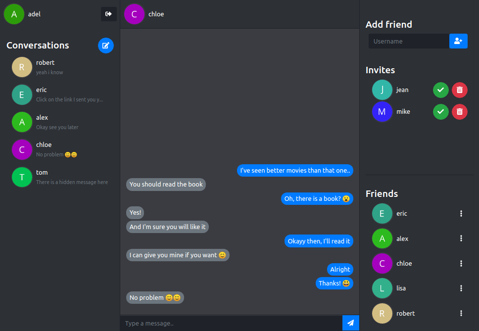

# Send.io

[Send.io](#) is a messaging application made with Node.js and React.

This repository contains the source code for the client side. For the server side check it out [here](https://github.com/adxl/Send.io_server).

## Features

Add your friends and start chatting with them.

## Screenshot

    

## License

[MIT](https://github.com/adxl/herme.io_client/blob/master/LICENSE.md) &copy; [Adel Senhadji](https://github.com/adxl)

